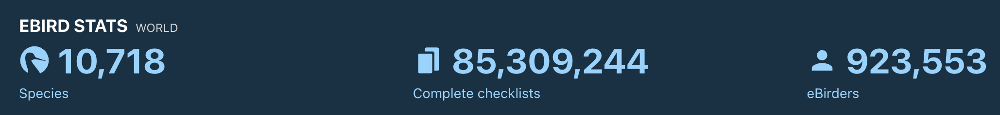
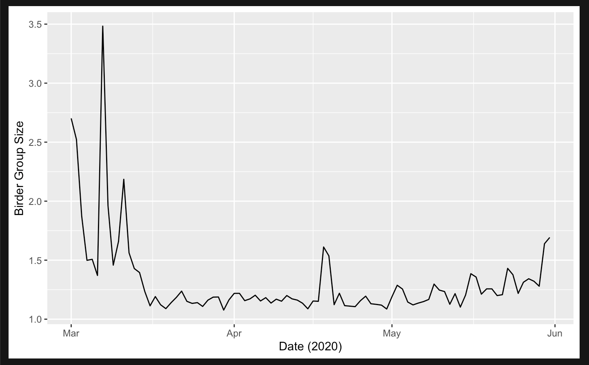

```{r setup, include=FALSE}
knitr::opts_chunk$set(echo = TRUE)
```

Welcome to my output for Lab 01! To make things a little cleaner, I'm hiding the chunk of code I used to import libraries. I'm loading **ggplot2**, **sf**, **tidyverse**, and **tmap**.

```{r libraries, include=FALSE}

### loading libraries
library(ggplot2)
library(sf)
library(tidyverse)
library(tmap)

```

### Response to Question Regarding Open Data Science

Question: *Discuss the advantages and challenges associated with an open data science approach. Provide an example based on this week's reading. (1-2 paragraphs)*

Open data involves making available the data -- and in many cases the code used to parse, clean and analyze that data -- underlying scientific output. The advantages to this approach are that science instantly and exponentially becomes more equitable, verifiable and reproducible. Open data can be a crucial intervention in the ongoing crises of data illiteracy and dis-/misinformation, and in cases of government data, can empower the people of the nation to participate in, evaluate, and respond to decisions that impact them and their futures. The example of government data also highlights some of the challenges of open data science, such as the ethics of withholding data, of who has access to data, and of who has a right to data privacy. 

This week's reading provides further insights into the challenges of big data (big data is data that is huge in volume and high in velocity, like smartphone user data, remote sensing or clickstream data; this is not the same as open data but they are overlapping phenomena). The overarching challenge is that big data is new, and traditional statistical methods, as well as traditional data ethics, are not up to the task; researchers and users of big data must make real-time decisions about how to responsibly analyze and interpret the massive amounts of data to which we have access. This data may be used for all of the wonderful things discussed above, or it may be used to leak personal health information (PHI) or manipulate elections or coerce consumers. I was most intrigued by the article's discussion of big data and a renaissance of positivism and empiricism that argues that because we have access to **so much** data, we no longer need to think carefully about human bias embedded in data or about limitations to the conclusions we can draw from that data. In reality, that we have access to **so much** data necessitates more and more careful scholarship into how that data can be leveraged responsibly.


### Overview of Data & Purpose of Project

The data used in this lab is [eBird data](https://ebird.org/data/download) for the country of Spain from March to May 2020. I'm in the early stages of planning a research project with a lab-mate (in Brian Weeks' lab). Our idea is to use data submitted on eBird, a citizen science platform, as a proxy to study the behavior of birders (rather than the explicitly designed purpose of studying birds). One direction we want to take is a sentiment analysis of the comments field in the data, so hopefully I will get to explore that option in the semantic analysis portion of this class. Another direction is to look at several variables that proxy sampling effort, like **duration of birding event**, **distance traveled during birding event**, and **size of birding group**. 
\
\




\
While we have yet to pin down a spatial and temporal extent for the broader project, for the purposes of this assignment I am looking at all of Spain, March - May 2019. The prime minister of Spain declared a state of alarm for the country that was intended to last 15 days on March 13, 2020 ("Sánchez decreta el estado de alarma durante 15 días," March 13, 2020); during this time, residents were to remain at home except to go to work or buy essentials ("Real Decreto 463/2020, de 14 de marzo, por el que se declara el estado de alarma para la gestión de la situación de crisis sanitaria ocasionada por el COVID-19," March 14, 2020.) All non-essential activity was further banned on March 28 ("Paralizada toda actividad no esencial en España," March 28, 2020). We know from eBird data that people continued to birdwatch in Spain. What we would like to better understand is whether or how birdwatching behavior was altered during lockdown.

```{r}

### reading in raw data
spain <- read.delim("./spain2020.txt", quote = "")

```


```{r}

### filtering to relevant fields + format date field as date data type
spain <- spain %>%
  mutate(date = as.Date(OBSERVATION.DATE)) %>%
  select(GLOBAL.UNIQUE.IDENTIFIER, SCIENTIFIC.NAME, OBSERVATION.COUNT, LATITUDE, LONGITUDE, date, OBSERVER.ID, PROTOCOL.TYPE, DURATION.MINUTES, EFFORT.DISTANCE.KM, NUMBER.OBSERVERS, ALL.SPECIES.REPORTED, SPECIES.COMMENTS)

```

For the sake of being able to commit everything, including the raw data, to Github, I'm randomly sampling 50K rows from the original 916,760 rows of eBird data and saving that sample to a CSV file. I will add the raw dataset to .gitignore so it is not committed (since it exceeds Github's storage limits).

```{r}

spain <- spain %>% sample_n(50000)

write.csv(spain, "./spain_sample.csv", row.names=FALSE)

```


```{r}

### transform df to sf object
spain_sf <- st_as_sf(spain, coords = c("LONGITUDE","LATITUDE"))
# st_crs(spain_sf)
### data is not projected

spain_sf <- st_set_crs(spain_sf, 2062) 

```

After converting the raw eBird data to an sf object, I found that it did not contain crs information, so I used an appropriate projection from [EPSG](https://epsg.io/). 

In the following code, I'm attempted to exclude the Canary and Balearic Islands. So far, we couldn't figure out how to get this code to work, so I'm pivoting for this lab, but I'd like to continue working on it. I've commented everything out so it doesn't run for this file.

```{r}

### read in Spanish autonomous communities shapefile as an sf object
### then project to same projection used for eBird data
# bounds <- read_sf("./spain_bounds/ESP_adm1.shp")
# bounds <- st_transform(bounds, 2062)

### identify and separate the two autonomous communities that contain the 
### islands I want to exclude for this map (recognizing that I'm filtering out
### some cool birds, probably)
# exclude <- bounds %>%
  #filter(NAME_1 == "Islas Baleares" | NAME_1 == "Islas Canarias")


# use_these <- spain_sf[lengths(st_intersects(spain_sf, exclude)) == 0,]
# bad <- st_filter(spain_sf, exclude)

# joined_data <- st_join(spain_sf, bounds[c("NAME_1", "geometry")])
### While this "worked," the names column is only NAs

```

Next, I wanted to complete some summary statistics to get a sense of the behavior of birds during lockdown. Eventually, this will be combined with data from before and after the pandemic to compare. The first chart shows the field "PROTOCOL.TYPE," which is a controlled field in eBird that designates what type of birding event the birder was participating in. The two most common values are "stationary," which indicates that the birdwatcher did not move (e.g. porch birding), and "traveling," which indicates that they traveled some distance while birding (e.g. taking a walk). The data is filtered to show daily counts in March 2020. There is a noticeable dip in overall counts around the middle of the month, approximately when the state of alarm and limited activity restrictions were put into place, and a marked downward trend in "traveling" birder events for the rest of the month.

```{r}

spain_march <- spain %>% filter(month(date) == 03)

ggplot(spain_march, aes(x=date)) +
  geom_bar(aes(fill=PROTOCOL.TYPE)) +
  labs(x = "Types of observation by date")

```

\
Next, I looked at the average size per day of the birder group -- i.e., how many people were birding together when they saw the recorded bird. This would be much more interesting to see if we had dates before and after lockdown to compare, but either way, we can still see a drop in average group size in March that continued for the rest of the date range. We can probably extrapolate that because the average is below 2 for the rest of the date range, people were birding either alone or with a domestic partner.

```{r}

avgs_birder_group <- spain %>%
  group_by(date) %>%
  summarize(average_group = mean(NUMBER.OBSERVERS, na.rm = TRUE))

ggplot(avgs_birder_group, aes(x=date, y=average_group)) +
  geom_line() +
  ylab("Birder Group Size") +
  xlab("Date (2020)")

```

NOTE: I don't know why the line graph is being rendered so differently when I knit the document, showing an average of over 6 people per group in the middle of April. That is not born out in the data so something is going wrong. Below, I show a screenshot of the line graph as I see it when I run my code. 



\
Finally, I wanted to map the types of birding events to see if any spatial patterns were immediately obvious. Since I'm really only interested in stationary and traveling events, I grouped all the remaining values as "Other" before mapping. These maps make it especially clear that most birding was stationary in April, although the "Traveling" event type increased again by May.

```{r}

not_needed <- c("Area", "Banding", "eBird Pelagic Protocol", "Historical", "Incidental", "Nocturnal Flight Call Count")

spain_sf$PROTOCOL.TYPE[spain_sf$PROTOCOL.TYPE %in% not_needed] <- "Other"

spain_sf_march <- spain_sf %>% filter(month(date) == 03)
spain_sf_april <- spain_sf %>% filter(month(date) == 04)
spain_sf_may <- spain_sf %>% filter(month(date) == 05)

```


```{r}

type_palette <- c("#808080", "seagreen", "pink3")

### using bbox to get around not being able to filter out the island groups

tm_shape(spain_sf_march,
         bbox=c(-9.39288367353, 35.946850084, 3.03948408368, 43.7483377142),
         is.main=TRUE) +
  tm_dots(col= "PROTOCOL.TYPE",
          size = 0.15,
          palette = type_palette,
          title = "Type",
          shape=19,
          alpha=.5) +
  tm_layout(main.title = "Types of Birding Events in Spain, March 2020 | Summer Mengarelli, October 2023",
            main.title.size = 0.8, legend.title.size = 0.9, main.title.position = "center", legend.position=c(.03,.35)) +
  tm_scale_bar(position = c("right", "bottom")) +
  tm_compass(position = c(0.85, 0.15))

tm_shape(spain_sf_april,
         bbox=c(-9.39288367353, 35.946850084, 3.03948408368, 43.7483377142),
         is.main=TRUE) +
  tm_dots(col= "PROTOCOL.TYPE",
          size = 0.15,
          palette = type_palette,
          title = "Type",
          shape=19,
          alpha=.5) +
  tm_layout(main.title = "Types of Birding Events in Spain, April 2020 | Summer Mengarelli, October 2023",
            main.title.size = 0.8, legend.title.size = 0.9, main.title.position = "center", legend.position=c(.03,.35)) +
  tm_scale_bar(position = c("right", "bottom")) +
  tm_compass(position = c(0.85, 0.15))

tm_shape(spain_sf_may,
         bbox=c(-9.39288367353, 35.946850084, 3.03948408368, 43.7483377142),
         is.main=TRUE) +
  tm_dots(col= "PROTOCOL.TYPE",
          size = 0.15,
          palette = type_palette,
          title = "Type",
          shape=19,
          alpha=.5) +
  tm_layout(main.title = "Types of Birding Events in Spain, May 2020 | Summer Mengarelli, October 2023",
            main.title.size = 0.8, legend.title.size = 0.9, main.title.position = "center", legend.position=c(.03,.35)) +
  tm_scale_bar(position = c("right", "bottom")) +
  tm_compass(position = c(0.85, 0.15))

```


\

#### References

Cué, C. E. (2020, March 13). Sánchez decreta el estado de alarma durante 15 días. El País. <https://elpais.com/espana/2020-03-13/el-gobierno-debate-decretar-el-estado-de-alarma.html>

Marcos, J. (2020, March 28). Paralizada toda actividad no esencial en España. El País. <https://elpais.com/espana/2020-03-28/el-gobierno-amplia-el-confinamiento-los-trabajadores-de-actividades-no-esenciales-deberan-quedarse-en-casa.html>

Agencia Estatal Boletín Oficial del Estado. (2020, March 14). "Real Decreto 463/2020, de 14 de marzo, por el que se declara el estado de alarma para la gestión de la situación de crisis sanitaria ocasionada por el COVID-19" (PDF). Boletín Oficial del Estado (67): 25390–25400. ISSN 0212-033X. <https://www.boe.es/boe/dias/2020/03/14/pdfs/BOE-A-2020-3692.pdf>

